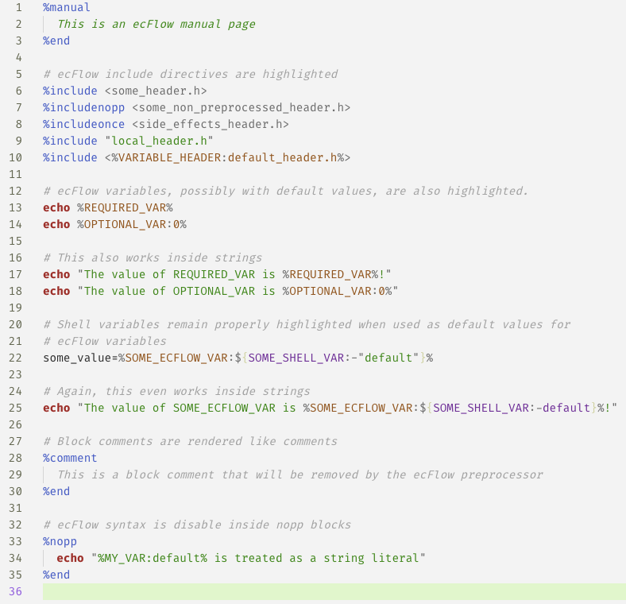
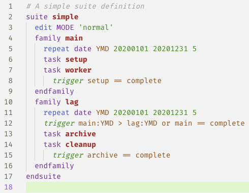

# Syntax highlighting for ecFlow

Support for syntax highlighting in shell scripts using ecFlow-specific syntax
and in ecFlow suite definition files.

## Features

Any ecFlow syntax within a shell script will be highlighted when the file's
language is set to ecflow-shell (automatic for `.ecf` and `.sms` extensions):

Highlighting for ecFlow suite definition files is also provided:

## Known issues

Highlighting of suite definition files is somewhat limited, being designed
primarily for reading generated suites rather than for writing or editing
them. As such it does not properly follow the definition file grammar and
cannot be relied upon for checking valid syntax. It can however make reading
a known-valid definition file generated by the ecFlow API a bit easier!

## Development

The final grammar file for ecflow-shell is generated automatically from the
files in `src/ecflow-shell-grammar`. Any edits to the ecflow-shell grammar
should be made in the source files and the grammar rebuilt using

    npm run build

This script will assemble the `syntaxes/ecflow-shell.tmLanguage.json` file.
